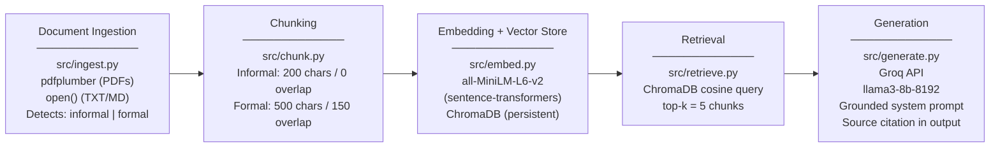

# Project 1 Planning: The Unofficial Guide

> Write this document before you write any pipeline code.
> Your spec and architecture diagram are what you'll use to direct AI tools (Claude, Copilot, etc.) to generate your implementation — the more specific they are, the more useful the generated code will be.
> Update the Retrieval Approach and Chunking Strategy sections if you change your approach during implementation.
> Update this file before starting any stretch features.

---

## Domain

Off-campus housing near NYU in New York City. Official university housing pages list options and prices but provide no qualitative signal — they cannot tell you which landlords are responsive, which buildings have noise or roach problems, which neighborhoods feel safe at night, or which leases have predatory terms. Students navigating NYC's housing market rely entirely on word-of-mouth and scattered Reddit threads. This system surfaces that experiential knowledge by ingesting Reddit posts, tenant reviews, neighborhood guides, subreddit wikis, and lease FAQ documents to answer the questions NYU's official housing page never could.

---

## Documents

<!-- List your specific sources: URLs, subreddit names, forum threads, or file descriptions.
     Aim for at least 10 sources that together cover different subtopics or perspectives within your domain. -->

| # | Source | Description | URL or location |
|---|--------|-------------|-----------------|
| 1 | r/NYU Reddit — off-campus housing megathread | Student posts about specific buildings, landlords, neighborhoods; informal first-hand experiences | https://www.reddit.com/r/nyu/ (search: "off campus housing" or "apartment") |
| 2 | r/NYU Reddit — landlord reviews / horror stories | Posts warning about specific landlords, management companies, or buildings near campus | https://www.reddit.com/r/nyu/ (search: "landlord" or "lease" or "avoid") |
| 3 | r/AskNYC Reddit — student housing near NYU | NYC-wide advice threads about living near Washington Square Park, East Village, Brooklyn | https://www.reddit.com/r/AskNYC/ (search: "NYU housing" or "student apartments Greenwich Village") |
| 4 | NYU Off-Campus Housing official page | Official list of landlord partners, price ranges, and neighborhood guides provided by NYU | https://www.nyu.edu/students/student-information-and-resources/housing-and-dining/off-campus-housing.html |
| 5 | NYU Off-Campus Housing subreddit wiki / FAQ | Community-maintained FAQ covering lease tips, neighborhoods, price expectations, broker fee laws | https://www.reddit.com/r/nyu/wiki/ (housing section if available) |
| 6 | Streeteasy neighborhood guides — Greenwich Village / East Village / Brooklyn | Formal neighborhood descriptions, average rents, commute times to NYU Tandon/Washington Square | https://streeteasy.com/blog/nyc-neighborhoods/ |
| 7 | NYC Tenant Rights guide (NYC.gov or Met Council) | Formal document covering lease terms, security deposit rules, rent stabilization, broker fees | https://www.nyc.gov/site/hpd/renters/tenants-rights.page or documents/nyc_tenant_rights.txt |
| 8 | NYU housing blog / student newspaper (Washington Square News) | Articles covering student housing experiences, lease scams, neighborhood safety near NYU | https://www.nyunews.com/ (search: "housing" or "off campus") |
| 9 | Yelp or Google Reviews for specific NYU-area landlords/buildings | Tenant reviews of specific management companies (e.g., Rose Associates, Stonehenge) near campus | documents/landlord_reviews_scraped.txt |
| 10 | Niche.com or Collegepads NYU off-campus housing listings with reviews | Aggregated student reviews of specific apartment buildings near NYU with pros/cons | https://www.niche.com/colleges/new-york-university/student-life/ or documents/niche_reviews.txt |

---

## Chunking Strategy

<!-- How will you split documents into chunks?
     State your chunk size (in tokens or characters), overlap size, and explain why those
     numbers fit the structure of your documents.
     A review-heavy corpus warrants different chunking than a long FAQ. -->

**Chunk size:** 200 characters for informal sources (Reddit posts, tenant reviews, social posts); 500 characters for formal sources (tenant rights guides, neighborhood pages, official NYU housing docs)

**Overlap:** 0 characters for informal (Reddit comments are self-contained opinions — overlap adds noise, not context); 150 characters for formal (legal language and neighborhood descriptions carry meaning across sentence boundaries — overlap prevents severed clauses)

**Reasoning:** Informal posts are short and atomic — a Reddit comment like "avoid 20 Cooper Square, management is unresponsive" is a complete unit that fits well under the 256-token embedding limit (~192 chars of English). Formal documents like the NYC Tenant Rights guide contain multi-sentence rules where a clause often finishes in the next sentence; 150-char overlap ensures retrieval catches the full rule even when it spans a chunk boundary. Formal chunk size is capped at 500 chars (~125 tokens) to stay safely within `all-MiniLM-L6-v2`'s 256-token embedding window — larger chunks would be silently truncated during encoding, degrading retrieval accuracy. Document type is detected automatically from the filename (files containing "reddit", "review", "post", or "thread" are classified informal; all others formal).

---

## Retrieval Approach

<!-- Which embedding model are you using (e.g., all-MiniLM-L6-v2 via sentence-transformers)?
     How many chunks will you retrieve per query (top-k)?
     If you were deploying this for real users and cost wasn't a constraint, what tradeoffs
     would you weigh in choosing a different embedding model — context length, multilingual
     support, accuracy on domain-specific text, latency? -->

**Embedding model:** `all-MiniLM-L6-v2` via `sentence-transformers` (local, no API cost, 256-token context window)

**Top-k:** 5

**Production tradeoff reflection:** `all-MiniLM-L6-v2` is fast and free but has a 256-token (~192 char) embedding context limit — this drove the decision to cap formal chunks at 500 chars. For production I'd weigh: (1) `text-embedding-3-small` (OpenAI) — 8191-token limit, no truncation risk on any chunk size, strong on domain-specific text, but API cost per query adds up at scale; (2) `e5-large-v2` (local) — stronger retrieval accuracy on dense factual text like tenant rights guides, still free, but 3–4× slower encoding; (3) a model fine-tuned on Reddit/review text if informal sources dominate. Multilingual support is irrelevant for this corpus. The core tradeoff is truncation safety vs. cost: MiniLM works with careful chunk sizing, but a production system serving real students would warrant the stronger context window of a hosted model.

---

## Evaluation Plan

<!-- List your 5 test questions with their expected correct answers.
     Questions should be specific enough that you can judge whether the system's response
     is right or wrong. "What are good dining halls?" is too vague.
     "What do students say about wait times at [dining hall name] during lunch?" is testable. -->

| # | Question | Expected answer |
|---|----------|-----------------|
| 1 | Which neighborhoods near NYU do students most recommend for off-campus housing, and why? | Names 1–3 neighborhoods (e.g., East Village, Crown Heights, Astoria) with student-cited reasons (price, commute, safety) from Reddit or review sources |
| 2 | What do NYU students say about renting from [specific landlord or management company] near campus? | Cites specific complaints or praise from Reddit posts or tenant reviews about that landlord's responsiveness, maintenance, and lease practices |
| 3 | What should NYU students know about broker fees and lease terms before signing an NYC apartment lease? | Summarizes key points from the NYC Tenant Rights guide or Reddit advice threads about broker fee laws, security deposit limits, and lease red flags |
| 4 | Which buildings or areas near NYU are frequently cited as having noise, safety, or maintenance problems? | Names specific buildings or streets mentioned negatively in Reddit threads or tenant reviews, with the cited issue |
| 5 | What is the typical price range for a studio or 1-bedroom apartment within walking distance of NYU's Washington Square campus? | Gives a price range grounded in Streeteasy data, Reddit posts, or official NYU housing page figures, with a neighborhood breakdown if available |

---

## Anticipated Challenges

<!-- What could go wrong? Name at least two specific risks with reasoning.
     Consider: noisy or inconsistent documents, missing source attribution, off-topic
     retrieval, chunks that split key information across boundaries. -->

1. **Noisy and address-specific informal sources:** Reddit posts about NYC housing frequently reference buildings and landlords by partial name, nickname, or address only (e.g., "the place on Bleecker," "rose assoc," "20 Cooper"). The embedding model has no geographic knowledge and may fail to match these to a query using a full name or neighborhood. A query about "Rose Associates management" might miss posts that only say "rose assoc" or "my landlord at 20 Cooper." Mitigation: preprocess documents to normalize common NYC landlord name variations before chunking.

2. **Legal language split across chunk boundaries:** The NYC Tenant Rights guide and similar formal documents contain multi-clause legal rules where the condition is in one sentence and the consequence is in the next (e.g., "If your landlord fails to return your security deposit within 14 days... they forfeit the right to make any deductions."). A chunk boundary between those two sentences makes both chunks individually incomplete and misleading. A query about security deposit rules could retrieve only the condition clause or only the penalty clause. Mitigation: 150-char overlap for formal docs reduces this risk; a more robust fix would split at sentence boundaries instead of fixed character counts.

---

## Architecture

**One-time:** Ingestion → Chunking → Embedding (run `pipeline.build_index()`)  
**Per query:** Retrieval → Generation (run `pipeline.query(collection, question)`)

---

## AI Tool Plan

<!-- For each part of the pipeline below, describe:
     - Which AI tool you plan to use (Claude, Copilot, ChatGPT, etc.)
     - What you'll give it as input (which sections of this planning.md, which requirements)
     - What you expect it to produce
     - How you'll verify the output matches your spec

     "I'll use AI to help me code" is not a plan.
     "I'll give Claude my Chunking Strategy section and ask it to implement chunk_text()
     with my specified chunk size and overlap" is a plan. -->

**Milestone 3 — Ingestion and chunking:**  
Tool: Claude Code (this session). Input: the Domain section, Documents table, and Chunking Strategy section from this planning.md. Task: implement `src/ingest.py` (load `.txt`/`.pdf`, detect informal vs. formal by filename) and `src/chunk.py` (informal: 200 chars/0 overlap; formal: 500 chars/150 overlap). Verification: run `pytest tests/test_ingest.py tests/test_chunk.py` — all tests pass with correct chunk sizes and type detection.

**Milestone 4 — Embedding and retrieval:**  
Tool: Claude Code (this session). Input: the Retrieval Approach section and the file map from the implementation plan. Task: implement `src/embed.py` (encode chunks with `all-MiniLM-L6-v2`, upsert to ChromaDB) and `src/retrieve.py` (query ChromaDB top-k=5, return chunks with source metadata). Verification: run `pytest tests/test_embed.py tests/test_retrieve.py` — collection count matches chunk count, most-relevant chunk ranks first for a known housing query.

**Milestone 5 — Generation and interface:**  
Tool: Claude Code (this session). Input: the Grounded Generation requirement (system prompt must cite sources, must not answer beyond retrieved documents) and the 5 Evaluation Plan questions. Task: implement `src/generate.py` (grounded Groq prompt with source citation) and `app.py` (Streamlit UI). Verification: manually run all 5 evaluation questions through the UI, record results in README.md evaluation table, confirm every response cites a source document.
